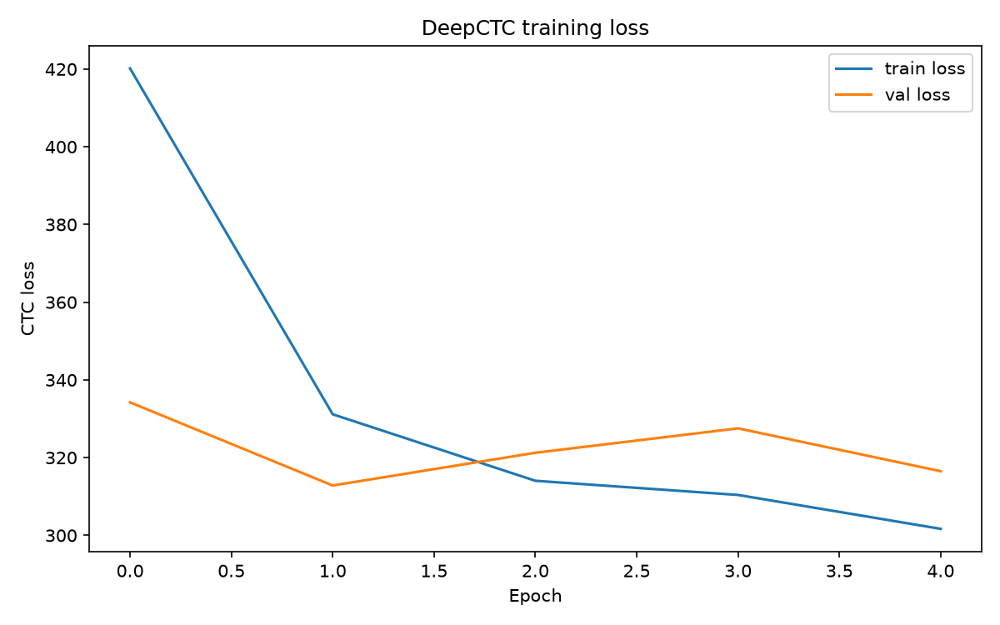

# Results

## Status: pipeline verified, full training not yet run

Everything below is from a **smoke test** (`python -m src.train --epochs 5 --subset 200
--batch_size 8`), run to confirm the end-to-end pipeline works: data loading, STFT
feature extraction, the CNN+BiGRU model, CTC loss, checkpointing, greedy decoding,
and evaluation all execute without errors and without NaN losses. It was trained on
only 200 of the 13,100 clips for 5 epochs, so the metrics below are **not**
representative of model quality — they only demonstrate correctness of the pipeline.

The reference target (~91.6% character accuracy, ~12.7 validation CTC loss) requires
a full run: `python -m src.train --epochs 100 --batch_size 32 --lr 1e-4` on the full
11,790/1,310 train/val split, which takes tens of epochs and multiple hours on a GPU.
Re-run `python -m src.evaluate --write_results` after that completes to append real
results to this file.

## Smoke-test run

- Train examples: 200, Val examples: 20 (subset of the full 11,790 / 1,310 split)
- Epochs: 5, batch size: 8, learning rate: 1e-4
- Train CTC loss: 420.17 -> 301.67
- Val CTC loss: 334.22 -> 316.51 (best: 312.83 at epoch 2, restored by EarlyStopping)
- No NaN losses at any step; train and val loss both trend downward overall.

## Evaluation (smoke-test checkpoint, 20 val examples)

- CER: 0.9872
- WER: 0.9970
- Accuracy (1 - CER): 0.0128

These numbers reflect a model trained on 200 examples for 5 epochs, not the full
dataset — expected to be near-random. They confirm `src/evaluate.py`'s CER/WER/
accuracy computation runs correctly end-to-end.

### Sample predictions

- true: `at that station the safes were given out heavy with shot not gold the thieves went on to dover and byandby`
  pred: `i ii   `
- true: `no traces of its moat have appeared`
  pred: `i  i`

## Sanity checks performed

- Vocab encode/decode round-trips correctly (`python -m src.vocab`).
- Sample spectrogram (`assets/sample_spectrogram.png`) shows clear formant bands and
  silence gaps, consistent with real speech rather than noise.
- Model builds with the expected shapes: freq dim 193 -> 97 -> 49 after the two
  stride-2 conv layers; ~8.07M parameters.
- `src/dataset.py` train/val split: 11,790 train / 1,310 val (90/10, seed=42) from
  the full 13,100-clip metadata.csv.
- `python -m src.infer --wav <file>` runs end-to-end and prints a transcript
  (empty/low-quality on the smoke-test checkpoint, as expected for 5 epochs).
